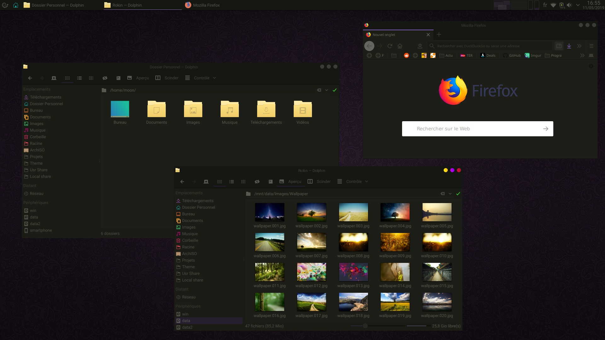
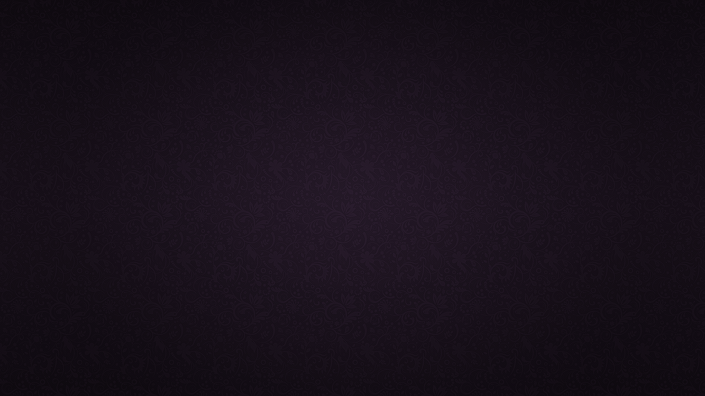

<p align="center">
    <a href="https://raw.githubusercontent.com/Rokin05/darkine-kde/master/plasma/look-and-feel/darkine/contents/previews/fullscreenpreview.jpg">
        
    </a>
    <a href="https://raw.githubusercontent.com/Rokin05/darkine-kde/master/sddm/themes/darkine/preview.jpg"></a> <a href="https://raw.githubusercontent.com/Rokin05/darkine-kde/master/wallpapers/Darkine/contents/screenshot.png"> </a>
</p>


## Darkine KDE - Theme for KDE Plasma 5 desktop :

The full theme pack is available on [OpenDesktop.org](https://www.opendesktop.org/p/) and on KDE Plasma Discover. <br>
You can also use the script below to install the latest version directly from this repo (independently on your distro).

<br>

| Name                      | Git (path)                     | OpenDesktop (tar.gz)                           | Misc                      |
|:--------------------------|:------------------------------:|:----------------------------------------------:|:--------------------------|
| Plasma Look-and-Feel Pack | [:link:](plasma/look-and-feel) | [:inbox_tray:](https://www.opendesktop.org/p/) |                           |
| Plasma Desktop Theme      | [:link:](plasma/desktoptheme)  | [:inbox_tray:](https://www.opendesktop.org/p/) |                           |
| Plasma Color Scheme       | [:link:](color-schemes)        | [:inbox_tray:](https://www.opendesktop.org/p/) |                           |
| Aurorae Theme             | [:link:](aurorae)              | [:inbox_tray:](https://www.opendesktop.org/p/) |                           |
| Kvantum Theme             | [:link:](Kvantum)              | [:inbox_tray:](https://www.opendesktop.org/p/) |                           |
| Icon-pack                 | [:link:](icons)                | [:inbox_tray:](https://www.opendesktop.org/p/) |                           |
| SDDM Theme                | [:link:](sddm)                 | [:inbox_tray:](https://www.opendesktop.org/p/) |                           |
| Wallpapers                | [:link:](wallpapers)           | [:inbox_tray:](https://www.opendesktop.org/p/) |                           |
| Firefox Quantum Theme     | [:link:](extra/firefox)        | [:inbox_tray:](https://www.opendesktop.org/p/) | [Darkine at addons.mozilla.org](https://addons.mozilla.org/addon/darkine) |
<br>

## Installation

#### Install
```
wget -qO- https://raw.githubusercontent.com/Rokin05/darkine-kde/master/install.sh | sh
```

#### Uninstall
```
wget -qO- https://raw.githubusercontent.com/Rokin05/darkine-kde/master/install.sh | uninstall=true sh

```
<br>

#### Note about SDDM theme :
_The SDDM Thème is build from scratch with [QtQuick 2](https://doc.qt.io/qt-5/qtquick-index.html) (Qt 5.7 >=)._<br>
_This is compatible with and without [KDE Plasma](https://kde.org/plasma-desktop) and not depend of KDE Framework._<br>
_You can learn more about it at : [SDDM-Themes (Git)](https://github.com/Rokin05/SDDM-Themes)._

Dependencies (sddm only)
> On KDE Plasma desktop, you normally have nothing more to install, but if one dependency is not present on other environments here are those used :

##### ● Debian / Ubuntu :
```shell
# On Ubuntu, universe repo maybe necessary : 
# add-apt-repository universe
apt-get update 
apt-get install qml-module-qtquick-layouts qml-module-qtquick-controls2 qml-module-qtquick-templates2 qml-module-qtgraphicaleffects
```

##### ● Arch :
```shell
pacman -S qt5-quickcontrols2 qt5-graphicaleffects qt5-svg
```
<br>

## Recommendations

- For better looking please use this pack with [Kvantum engine](https://github.com/tsujan/Kvantum/tree/master/Kvantum). <br>
  Run `kvantummanager --set Darkine` to choose and apply theme.
<br>

#### Fonts :
```
# Arch :
sudo pacman -S adobe-source-code-pro-fonts ttf-roboto

# dnf (Fedora)
sudo dnf install adobe-source-code-pro-fonts google-roboto-fonts

# pkg(8) (FreeBSD)
pkg install sourcecodepro-ttf roboto-fonts-ttf

kwriteconfig5 --file kdeglobals --group General --key fixed "Source Code Pro,9,-1,5,50,0,0,0,0,0,Regular"
kwriteconfig5 --file kdeglobals --group General --key font "Roboto,10,-1,5,50,0,0,0,0,0,Regular"
kwriteconfig5 --file kdeglobals --group General --key menuFont "Roboto,10,-1,5,50,0,0,0,0,0,Regular"
kwriteconfig5 --file kdeglobals --group General --key smallestReadableFont "Roboto,8,-1,5,50,0,0,0,0,0,Regular"
kwriteconfig5 --file kdeglobals --group General --key toolBarFont "Roboto,10,-1,5,50,0,0,0,0,0,Regular"
kwriteconfig5 --file kdeglobals --group WM --key activeFont "Roboto,9,-1,5,50,0,0,0,0,0,Regular"

qdbus org.kde.KWin /KWin reconfigure
kquitapp5 plasmashell && kstart5 plasmashell
```

#### Toolbar icon size :
```
kwriteconfig5 --file kdeglobals --group MainToolbarIcons --key Size "22"
kwriteconfig5 --file kdeglobals --group ToolbarIcons --key Size "22"

qdbus org.kde.KWin /KWin reconfigure
kquitapp5 plasmashell && kstart5 plasmashell
```

<br>

## Licence

Source code of is licensed under GNU GPL version 3.<br>
QML files are MIT licensed and images are CC BY 3.0.

<br>

## Credits

- KDE Plasma - [icons](https://github.com/KDE/breeze-icons) _(Breeze)_.
- Papirus    - [icons](https://github.com/PapirusDevelopmentTeam/papirus-icon-theme) _(PapirusDevelopmentTeam)_.

<br>

## Donate

The development, the publication and the different tests are done in my free time,<br>
If you like my project, you can send a coffee at : 

<span class="paypal"><a href="https://www.paypal.me/Rokin05" title="Donate to this project using Paypal"></a></span>